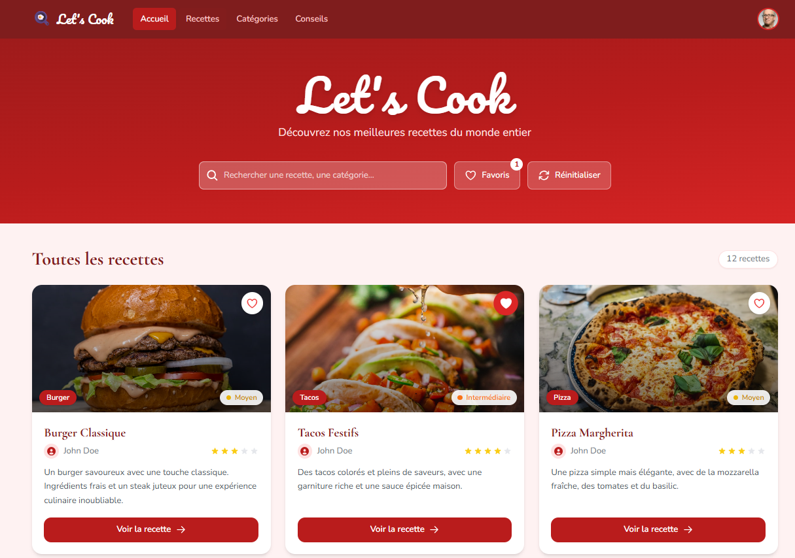

<div align="center">

# 🍳 Let's Cook

**Une application de recettes moderne, belle et fonctionnelle.**



</div>

---

## Fonctionnalités

- **Recherche en temps réel** — filtrez les recettes par titre, catégorie ou description
- **Favoris** — ajoutez des recettes à vos favoris d'un clic (avec son !)
- **Filtre favoris** — affichez uniquement vos recettes sauvegardées
- **Réinitialisation** — remettez tout à zéro en un clic
- **12 recettes** du monde entier avec photos haute qualité
- **Indicateur de difficulté** — de Facile à Difficile, avec code couleur
- **Design responsive** — adapté mobile, tablette et desktop

---

## Stack technique

| Technologie | Usage |
|---|---|
| [React 18](https://react.dev/) | UI & gestion d'état |
| [Vite](https://vitejs.dev/) | Bundler & dev server |
| [Tailwind CSS](https://tailwindcss.com/) | Styles utilitaires |
| [Headless UI](https://headlessui.com/) | Composants accessibles (Navbar) |
| [Heroicons](https://heroicons.com/) | Icônes SVG |
| [Google Fonts](https://fonts.google.com/) | Pacifico · Cormorant Garamond · Nunito |

---

## Lancer le projet

```bash
# Installer les dépendances
npm install

# Démarrer le serveur de développement
npm run dev
```

L'application est disponible sur `http://localhost:5173`

---

## Structure du projet

```
src/
├── App.jsx                    # Composant racine + état global
├── Navbar.jsx                 # Barre de navigation
├── recettes.json              # Données des 12 recettes
├── components/
│   ├── SearchBar/
│   │   ├── SearchBar.jsx      # Champ de recherche live
│   │   ├── HeartButton.jsx    # Bouton filtre favoris
│   │   └── ResetButton.jsx    # Bouton réinitialiser
│   ├── Body/
│   │   ├── body.jsx           # Grille de recettes filtrées
│   │   └── Favoris.jsx        # Bouton cœur sur chaque carte
│   └── Footer/
│       └── Footer.jsx         # Pied de page
└── assets/
    └── heartSound.mp3         # Son au clic favori
```

---

<div align="center">
  Fait avec ❤️ — <em>Let's Cook</em>
</div>
